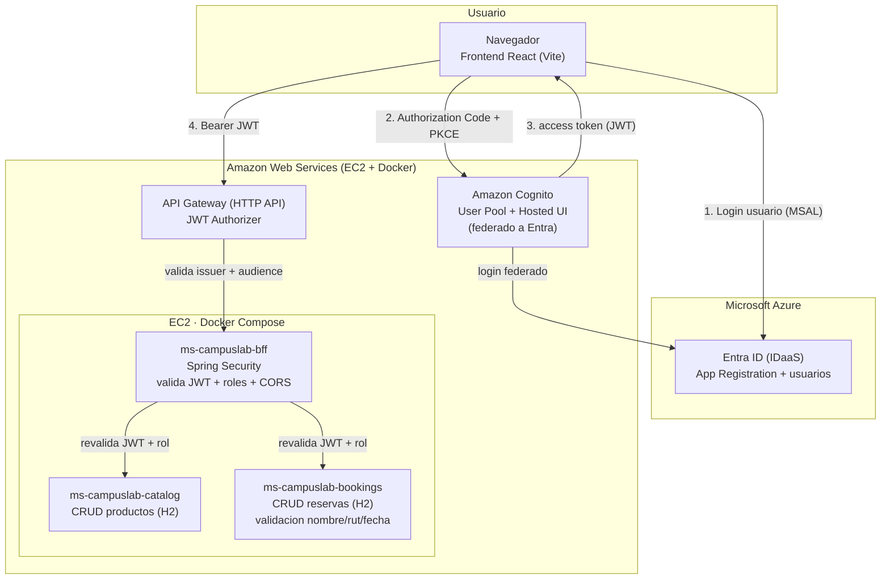

# Arquitectura — CampusLab (Caso 2)

Sistema de reserva de laboratorios y equipos académicos. Esta entrega implementa el
núcleo del caso con **frontend React**, **microservicios Spring Boot**, un **BFF** con
Spring Security detrás de **AWS API Gateway**, e identidad mediante **Amazon Cognito
federado con Microsoft Entra ID**.

## Diagrama

## Flujo de identidad y seguridad

1. El usuario inicia sesión con **Microsoft (Entra ID)** vía MSAL en el frontend.
2. El frontend ejecuta **OIDC Authorization Code + PKCE** contra **Cognito Hosted UI**.
   Como Cognito está **federado a Entra**, el login se delega a Microsoft (SSO) y Cognito
   emite su propio **access token** (JWT).
3. El frontend envía ese JWT como `Authorization: Bearer <token>` a **API Gateway**.
4. **API Gateway** valida el token con su **JWT Authorizer** (issuer del User Pool +
   audience = client_id). Rechaza con **401** los tokens ausentes o inválidos.
5. La petición llega al **BFF**, que **vuelve a validar** el JWT (firma, issuer,
   `token_use=access`, `client_id`) y aplica **autorización por rol** (claim
   `cognito:groups`). Si el rol no puede usar el endpoint responde **403**.
6. El BFF reenvía la petición al microservicio de dominio (**catalog** o **bookings**),
   que son internos (no expuestos públicamente).

> Regla de oro del caso: **JWT → API Gateway → BFF → microservicio de dominio.**

## Componentes

| Componente | Tecnología | Rol |
|---|---|---|
| frontend-campuslab | React + Vite + TypeScript + MSAL | Login Microsoft, PKCE con Cognito, CRUD |
| ms-campuslab-bff | Spring Boot + Spring Security (OAuth2 RS) | Valida JWT, roles, CORS, enruta al dominio |
| ms-campuslab-catalog | Spring Boot + JPA (H2) | CRUD de productos/recursos |
| ms-campuslab-bookings | Spring Boot + JPA (H2) | CRUD de reservas + validación de esquema |
| Amazon Cognito | User Pool + Hosted UI | IDaaS / emisor del JWT, federado a Entra |
| Microsoft Entra ID | App Registration | Autenticador corporativo (Microsoft) |
| AWS API Gateway | HTTP API + JWT Authorizer | Puerta de entrada, valida JWT (sin Lambda) |
| EC2 + Docker Compose | Amazon Linux 2023 | Despliegue de las apps |

## Roles

- **Admin**: administra el catálogo (crea/edita/elimina productos) y cambia estados. Existe
  y está cableado aunque su alcance funcional sea acotado.
- **Operador**: puede cambiar el estado de las reservas.
- **Usuario autenticado**: consulta catálogo y crea/consulta reservas.

Los roles se derivan del claim `cognito:groups` del token (grupos del User Pool).

## Esquema de datos validado (Bean Validation)

**Reserva**: `nombre` (string, obligatorio), `rut` (string, formato `12345678-9`),
`fecha` (datetime ISO `yyyy-MM-ddTHH:mm:ss`), `productoId` (obligatorio).
Un cuerpo inválido responde **400** con el detalle por campo.

## Fuera de alcance (por decisión del encargo)

- **Kafka / streaming** y **KPIs / reportería** (los últimos servicios del caso).
- **Auditoría** por streaming.
- **AWS Lambda**: el API Gateway integra por **HTTP_PROXY** directo al BFF en EC2.
